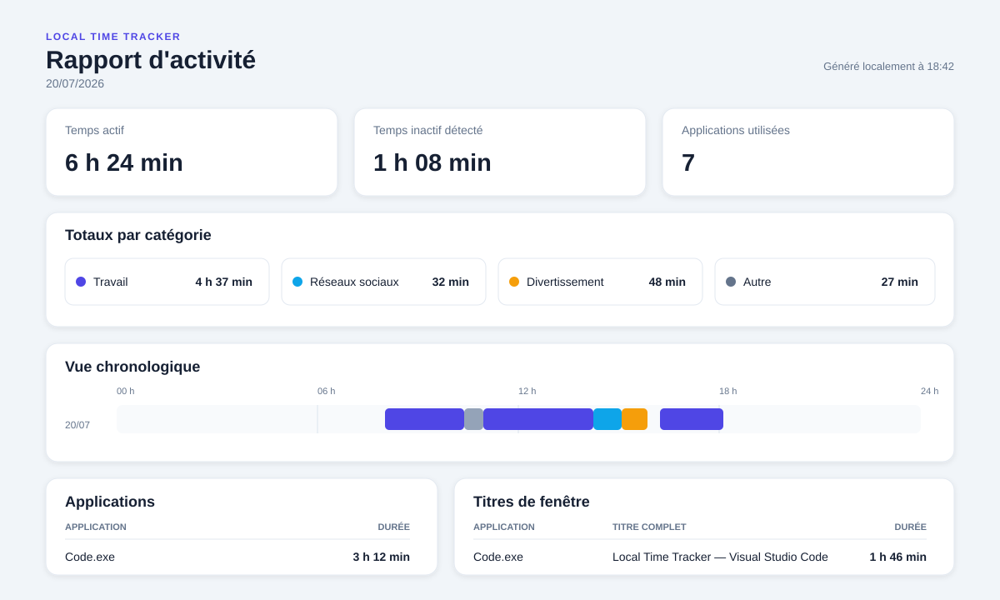

# Local Time Tracker

**See where your Windows time goes — without sending your activity anywhere.**

[](https://github.com/HafidIdrissi/Time-Tracker/releases/latest)
[](https://github.com/HafidIdrissi/Time-Tracker/releases)
[](https://github.com/HafidIdrissi/Time-Tracker/actions/workflows/tests.yml)
[](LICENSE)
[](#requirements)

Local Time Tracker is a free, open-source Windows application that automatically
measures time spent in applications and browser tabs. Your activity stays in a
local SQLite database: no account, no cloud service, no advertising, and no
telemetry.

### [Download Local Time Tracker for Windows](https://github.com/HafidIdrissi/Time-Tracker/releases/latest)

Download the `LocalTimeTracker-Setup-<version>-x64.exe` installer from the
latest release. A SHA-256 checksum is published beside every installer.



## Why Local Time Tracker?

- **Private by design:** activity is stored only on your Windows computer.
- **Automatic:** tracks the foreground application, window title, browser tab,
  and idle periods without manual timers.
- **Useful at a glance:** see daily and seven-day summaries, charts, categories,
  applications, and browser tabs.
- **Offline:** the desktop application and generated HTML reports work without
  an internet connection.
- **Open source:** inspect, modify, and distribute the application under the MIT
  License.

Local Time Tracker is deliberately focused: a straightforward Windows desktop
application for people who want useful activity insights without creating an
account or operating a server.

## Quick start

1. Open the [latest release](https://github.com/HafidIdrissi/Time-Tracker/releases/latest).
2. Download the Windows installer and `SHA256SUMS.txt`.
3. Optionally [verify the installer checksum](#verify-the-windows-installer-checksum).
4. Run the installer and open **Local Time Tracker** from the Start menu.

The application starts tracking automatically. Switch between a few
applications, then open **Usage analysis** to see the results.

### Verify the Windows installer checksum

Before you run the installer, you can confirm the download was not corrupted or
tampered with by comparing its SHA-256 hash to the published `SHA256SUMS.txt`
file from the same release.

In PowerShell, from the folder that contains both files:

```powershell
# Example file name pattern for the latest release (replace <version> with the
# version shown on the Releases page, e.g. 1.1.0):
#   LocalTimeTracker-Setup-<version>-x64.exe
#   SHA256SUMS.txt

Get-FileHash .\LocalTimeTracker-Setup-<version>-x64.exe -Algorithm SHA256
Get-Content .\SHA256SUMS.txt
```

- If the hash printed by `Get-FileHash` matches the hash listed for that installer
  in `SHA256SUMS.txt`, the file matches the published release artifact.
- If the hashes differ, do not run the installer. Re-download both files from the
  [latest release](https://github.com/HafidIdrissi/Time-Tracker/releases/latest)
  and verify again.

Keep the main install steps short: verification is optional, but recommended
when you want extra confidence in the binary you are about to install.

> [!NOTE]
> The current installer may be unsigned. Windows SmartScreen can therefore show
> a warning until releases are signed with a trusted Authenticode certificate.
> See [SIGNING.md](SIGNING.md) for details.

## Features

- native Windows desktop interface;
- live foreground application and window title;
- Start, Stop, and Reset controls;
- configurable sampling interval and idle threshold;
- active and idle time summaries;
- analysis for today or the last seven days;
- hourly and daily usage charts;
- rankings by category, application, and browser tab;
- support for Chrome, Edge, Firefox, Brave, Opera, and Vivaldi titles;
- standalone offline HTML reports;
- local SQLite storage with no telemetry or advertising;
- Windows installer and automated GitHub releases.

## What the tracker measures

The tracker samples the Windows foreground window at a configurable interval.
For every sample, it records:

- the foreground process name, such as `Code.exe` or `chrome.exe`;
- the foreground window title, which may contain a browser-tab title;
- the start and end time of the continuous period;
- whether Windows reported keyboard and mouse inactivity.

A new period begins when the foreground application, window title, or idle state
changes. Consecutive samples for the same window extend the current period.

### Multiple monitors and games

Windows has one foreground window for the whole desktop. Local Time Tracker
therefore follows keyboard focus, not the monitor containing the mouse pointer.

For example, a game remains recorded while it has foreground focus. Clicking
Visual Studio Code, Chrome, Search, or a Windows system panel starts a new
period. Returning focus to the game starts or resumes its period. After the
configured idle threshold, the time is recorded as idle even if the game is
still visible.

The tracker reports foreground focus; it does not claim that the user was
continuously reading or interacting with the content.

## Desktop interface

The application provides three views.

### Dashboard

- current application and window title;
- duration of the current foreground window;
- keyboard and mouse idle time;
- active time, idle time, application count, and period count for today;
- recent activity timeline with exact durations and states.

### Usage analysis

- Today and Last 7 days views;
- total active screen time and daily average;
- longest continuous active session;
- hourly or daily stacked usage chart;
- most-used categories and applications;
- most-used browser tabs.

Browser titles such as `Gmail - Google Chrome` are normalized to `Gmail`, so
separate visits to the same tab are added together.

### Reports and data

- generate an offline HTML report for a selected date;
- open the local reports folder;
- reset all recorded activity from the interface.

Reset deletes periods from the SQLite database. Previously generated HTML
reports are intentionally kept. The official uninstaller removes the local app
data directory.

## Local data and privacy

Installed application data is stored under:

```text
%LOCALAPPDATA%\LocalTimeTracker\
├── data\activity.db
└── reports\
```

When run directly from the repository, the equivalent folders are inside the
project directory.

Window and browser-tab titles can contain sensitive information such as
document names, searches, email subjects, account names, or private website
titles. Do not publish `activity.db` or personal HTML reports. The database is
not encrypted by the application; access relies on the Windows account and disk
security.

Read the complete [Privacy Policy](PRIVACY.md) and the instructions for
[reporting security issues](SECURITY.md).

## Categories

Activity is categorized with case-insensitive keywords from `config.json`. If
that file does not exist, the application uses `config.example.json`.

```json
{
  "default_category": "Other",
  "default_color": "#64748b",
  "categories": [
    {
      "name": "Work",
      "color": "#4f46e5",
      "keywords": ["code.exe", "github", "gmail"]
    },
    {
      "name": "Games",
      "color": "#ec4899",
      "keywords": ["steam.exe", "tslgame.exe", "pubg"]
    }
  ]
}
```

The first matching category wins, so place specific rules before broad rules.
Changes are reflected the next time analysis or a report loads the
configuration.

## Run from source

### Requirements

- Windows 10 or Windows 11, 64-bit;
- Python 3.11 or later;
- Git, if cloning the repository.

Clone and prepare the environment in PowerShell:

```powershell
git clone https://github.com/HafidIdrissi/Time-Tracker.git
cd Time-Tracker
py -m venv .venv
.\.venv\Scripts\Activate.ps1
python -m pip install --upgrade pip
pip install -r requirements.txt
```

Launch the desktop application:

```powershell
python windows_app.py
```

You can also double-click `Launch Time Tracker.cmd` after creating `.venv`. Do
not run the source and installed versions simultaneously because two trackers
would record overlapping periods.

## Command-line tools

Start the terminal-only tracker:

```powershell
python track.py
python track.py --interval 2 --idle-after 300 --database data/activity.db
```

Generate reports:

```powershell
python report.py
python report.py --date 2026-07-20
python report.py --from 2026-07-14 --to 2026-07-20
```

Reports contain active and idle totals, categories, a timeline overview,
application shares, window titles, and every recorded period. They contain no
external scripts, fonts, trackers, or network dependencies.

## Test the application

Run the automated test suite:

```powershell
.\.venv\Scripts\python.exe -m unittest discover -v
```

Recommended interface smoke test:

1. start `windows_app.py` and confirm the status is **Running**;
2. switch between several applications and verify the live title updates;
3. open **Usage analysis** and confirm applications and tabs appear;
4. stop and restart tracking;
5. generate and open today's HTML report;
6. test **Reset** only with disposable data.

## Build and release

Build the Windows application:

```powershell
.\build_windows.ps1
```

Build a tested installer:

```powershell
.\build_release.ps1 -Version 1.1.0
```

This produces the installer and checksum under `release\`. Pull requests and
changes to `main` run `.github/workflows/tests.yml`. Pushing a semantic version
tag such as `v1.1.0` starts `.github/workflows/release.yml`, which tests the
project, builds the installer, and publishes the GitHub release.

Never reuse or move a published version tag. If a released version changes,
increment the version and create a new tag.

## Project structure

```text
.
├── windows_app.py                 # Windows desktop interface
├── track.py                       # command-line tracking
├── report.py                      # command-line report generation
├── timetracker\                   # tracking, storage, and analytics
├── tests\                         # automated tests
├── assets\                        # repository and report visuals
├── packaging\installer.iss       # Inno Setup definition
├── build_windows.ps1              # PyInstaller build
└── build_release.ps1              # tested installer build
```

## Known limitations

- foreground focus is measured, not the mouse pointer position;
- activity shorter than the sampling interval may not be observed;
- some elevated windows may hide their title from a non-elevated application;
- browser-tab reporting depends on the title format provided by the browser;
- the application currently supports Windows only.

## Contributing

Bug reports, feature ideas, documentation improvements, and code contributions
are welcome. Read [CONTRIBUTING.md](CONTRIBUTING.md), browse the
[roadmap](ROADMAP.md), or start with a
[`good first issue`](https://github.com/HafidIdrissi/Time-Tracker/issues?q=is%3Aissue+is%3Aopen+label%3A%22good+first+issue%22).

For usage questions, see [SUPPORT.md](SUPPORT.md). Please follow the
[Code of Conduct](CODE_OF_CONDUCT.md) in all project spaces.

## License and publisher

Local Time Tracker is published by **H.I. SOLUTIONS** and licensed under the
[MIT License](LICENSE). Legal publisher information is available in
[LEGAL.md](LEGAL.md).
