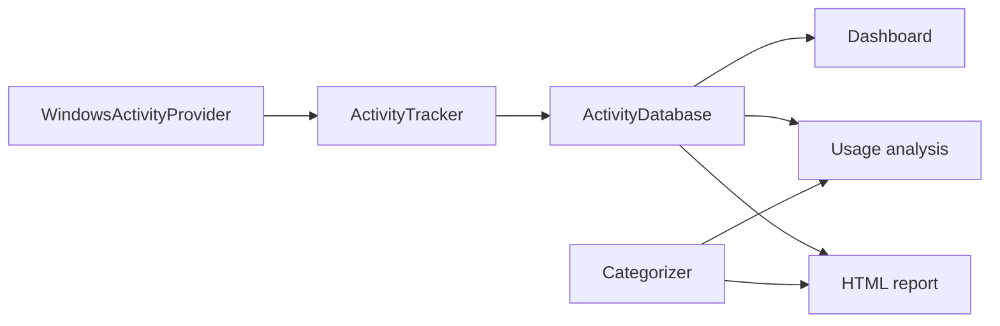

# Architecture and local data flow

This guide explains how one Windows sample becomes a stored period, a dashboard
figure, and an offline HTML report. It is for contributors. Users can follow
the README instead.

## Sampling

`timetracker/windows.py` owns sampling. `WindowsActivityProvider` reads the
foreground process and window title, plus idle time from the Windows tick
count. It does not write to disk. Tests inject fake Win32 objects and must not
read a real desktop.

## Transitions

`timetracker/tracker.py` owns period transitions. `ActivityTracker` polls the
provider and turns snapshots into continuous periods. The same application and
title extend the current period. A different window closes that period and
starts another. Idle time beyond the threshold is stored as its own period.
`record_snapshot()` is the testable boundary; the loop only adds polling and
shutdown.

## Persistence

`timetracker/database.py` owns persistence. `ActivityDatabase` stores periods
in SQLite using WAL mode. Timestamps are normalized to UTC. An end time that
would precede its start is clamped, so stored durations stay non-negative.
`periods_between()` returns stored rows that overlap a half-open range. It
does not clip them.

## Clipping, categories, and rendering

`timetracker/reporting.py` owns clipping and HTML rendering. `collect_periods()`
clips stored rows to the selected range and drops zero-length results. Idle
rows use a fixed Idle label. Active rows keep their application and title.

`timetracker/categories.py` owns categorization. `load_categorizer()` reads
`config.json`. The first case-insensitive keyword match wins. Idle is always
Idle, before keywords.

`timetracker/analytics.py` owns usage totals, rankings, the longest active
session, and hourly or daily buckets. It does not read the database itself.

## Desktop interface

`windows_app.py` is the Windows interface. A worker thread runs the tracker.
Samples and status changes are posted to a queue, and the Tk main thread
applies them. The interface must not query Win32 from that main thread.

The Dashboard reads recent periods. Usage analysis calls `collect_periods()`
and `analyze_usage()`. Reports and data calls `generate_report()` and can open
the reports folder or reset stored periods after confirmation.

## Where data lives

From a source checkout, the database is `data/activity.db`, reports are in
`reports/`, and a personal `config.json` lives in the repository root when the
user creates one. Otherwise the example configuration is used.

An installed build stores the database and reports under
`%LOCALAPPDATA%\LocalTimeTracker\`. The tracker does not upload either copy.

## Privacy boundaries

- There is no network client, account, or telemetry in the tracking path.
- Window titles can contain private document names, searches, or mail subjects.
- Tests, screenshots, and pull requests use synthetic titles only.
- Do not attach `activity.db`, a personal report, or a real configuration file.
- Reset deletes stored periods only after an explicit confirmation. Generated
  HTML reports are separate files and are not removed by that action.
